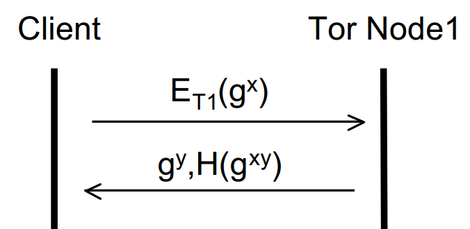
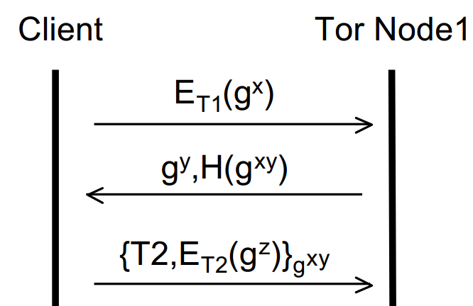
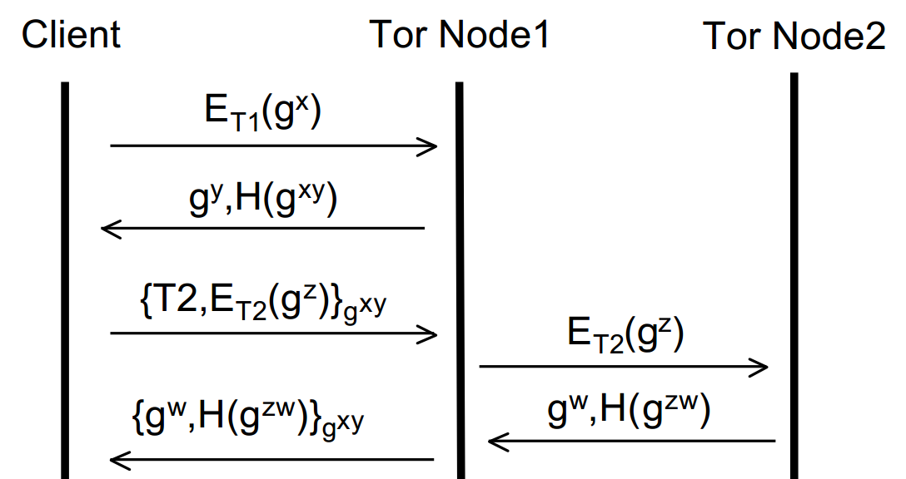
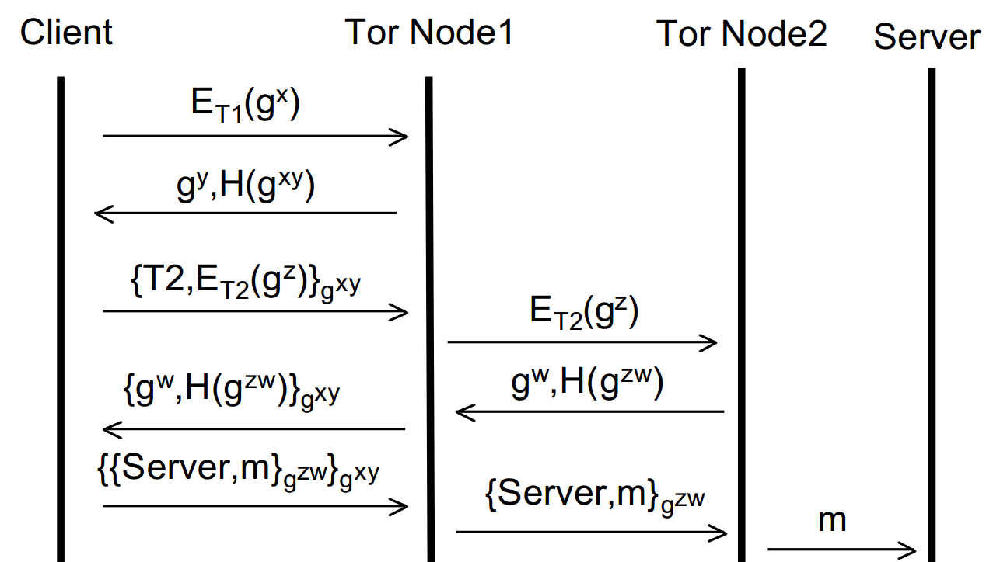

In this blog post I’m going to dissect Tor (previously an acronym for The Onion Router but now a name in and of itself): how it works and how to use it properly ([part two](/tor-down-for-what-part-two)). So this post doesn’t become an entire book, I’m going to assume a basic understanding of cryptography and a somewhat decent command of maths. Nonetheless, I’ll try to explain all concepts clearly and concisely and, where possible, omit needless complexities.

**So, what is Tor?** Well, put simply it’s the name of a network service that is based on the principles of Onion Routing, a technique for anonymous communication developed by the US Navy. It’s also free and pretty much the de facto standard online anonymity tool. It provides anonymity (not confidentiality) online, which to put it in layman’s terms: people can see what you write, but won’t know it was you who wrote it. It’s not foolproof (I’ll address the shortcomings in detail in part two), however it does provide a damn good curtain against all but the most persistent and well equipped interlopers, and, if used extremely pedantically, could even thwart them.

**How does it work?** Tor uses Onion Routing, a system of building up a plaintext message in a series of encryption layers such that each layer is sequentially unwrapped by a series of intermediaries (nodes). The original plaintext message is only viewable at most by the sender, the recipient and the final intermediary (the exit node). If there is end to end encryption between the sender and recipient, then not even the exit node can read the message.

A few key terms before we begin:

*Asymmetric Cryptography:* (aka public key cryptography): Essentially a cryptographic system that uses two keys, public and private. The sender encrypts their message with the recipients public key (which is public), and the recipient decrypts the message using their private key, known only to them.

*Symmetric Cryptography:* The same key is used for both encryption AND decryption. The drawback of symmetric key encryption is distributing the key to both parties.

Transport Layer Security:* TLS (now superseded by SSL - *Secure Sockets Layer*) is protocol to provide privacy and data integrity between two communicating applications: it adopts asymmetric cryptography using X.509 certificates for mutual authentication and to establish a symmetric key to encrypt further communication.

*Diffie-Hellman:* Diffie-Hellman is a key-exchange protocol for setting up a secret symmetric key over an insecure channel. Once the key is established, the two parties wishing to communicate can do so with symmetric encryption using the shared key.

**The Tor Design:**

I’ve actually omitted a few details from this explanation for brevity (noticeably, the intricacies of how traffic passes between Tor nodes via ‘cells’ containing specific instructions). These omissions notwithstanding, however, I think the explanation below is well delivered to grasp the strengths of the underlying mechanics of Tor without being boggled down in small minutiae. If anyone is interested in the whole deal, here is a lengthy explanation on Tor from the Tor project itself: [https://svn.torproject.org/svn/projects/design-paper/tor-design.html](https://svn.torproject.org/svn/projects/design-paper/tor-design.html) . What follows is a simply explained, conceptual overview of how Tor iteratively creates a secure circuit for anonymous communication.

I’m going to have to get a bit mathematical hereafter, so bear with me as I’ll try and make everything as easy to understand as possible.

Each ‘node’ in the Tor Circuit is called an Onion router. These communicate with one another, and with the user’s Onion Proxy, via TLS. Using TLS conceals the data on the connection with perfect forward secrecy, and prevents an attacker from modifying data on the wire or impersonating a router. Each Onion router maintains a long-term identity key and a short-term onion key; the identity key is used to sign the X.509 TLS certificates and the short-term onion key is used to decrypt requests from users to set up a circuit and negotiate ephemeral session keys. To make a connection via Tor, a circuit between the user’s Onion Proxy and the requested resource is created through a link of Onion routers.

The circuit creation process starts by the originator (the user’s Onion Proxy) looking up the public ‘Onion’ key of the first node in the circuit (from a directory) to send it an asymmetrically encrypted message. This message contains the originator’s half of the Diffie-Hellman handshake to be used to establish a symmetric key with which to encrypt further communication (which has significantly less overhead than using asymmetric encryption throughout).

The first (entry) node then replies in plaintext with their half of the Diffie-Hellman handshake and a hash of the shared secret to verify that both parties share the same key and it has not been tampered with. Diagrammatically, we can represent the process so far like so:

Where ET1 means public key encryption using the Onion key of Tor Node 1, gx/ gy are the respective halves of the DH handshake and H(gxy) is the hash of the shared secret key.

The originator and Node 1 now have a shared secret key (gxy) with which they can encrypt all subsequent communication. This is an ephemeral (short lived) key known as a ‘session key’ and achieves forward secrecy and key freshness. We know this key is secret between the originator and Node 1 as gx was sent encrypted with Node 1′s Onion key. Now we can continue to build up the layers of the onion and extend the circuit. The originator can now send an extension message to Node 1 requesting to create a further relay to Node 2. To this end, the originator sends to Node 1 an instruction to talk to Node 2 along with a new half of the DH handshake (as the originator must create another session key – this time with Node 2) encrypted with Node 2′s Onion key (again, looked up from a directory). This entire message is encrypted with the session key of Node 1. It’s easier to see in a diagram, so without further ado:

Where T2 is the instruction to talk to Node 2, ET2 is the Onion key of Node 2 and gz is the originators half of the DH handshake to establish the session key with Node 2.

From here, all the first node can do is forward that message to the second node. They can’t tamper with it (as it’s encrypted with the second nodes Onion key). It’s also important to note that at this stage, the second node can’t tell whether the first node is or isn’t the originator and equally the first node doesn’t even know if the originator is the originator or just another node in the circuit. Just like before (with the first node and the originator), the second node replies to the first node with its half of the DH handshake and a hash of the secret key. Node 1 then encrypts this with the session key it has with the originator and forwards it to them. The originator can guarantee everything is ok by calculating and checking the hash against what it receives from Node 2 – if it doesn’t compute then something’s not right! Let’s build the diagram up further:

Now the originator has two session keys, gxy and gzw – he or she is thus able to apply two layers of encryption one on top of the other – hence the name Onion Routing!  This process could in theory be repeated ad infinitum and more and more nodes added to the circuit. However, for brevity, let’s assume that we’re happy with a circuit of size two. We’re now ready to send data over the interwebs anonymously! Say we wanted to open a website (via a HTTP GET request). We’d encrypt the message first with the session key between (originator + Node 2) and then encrypt that entire thing with the session key between (originator + Node 1).

When this is sent, the first node will be able to decrypt the message, but only to the point of stripping one layer of encryption. He won’t be able to actually read the HTTP GET request – as that’s encrypted with the session key for Node 2! So all Node 1 can do at this stage is forward the encrypted message to Node 2. Node 2 then decrypts the message, sees the HTTP get request and sends that off to the ip of whatever domain was specified. The originator has no confidentiality at this stage – Node 2 can read the get request (hell, Node 2 could even modify it if it had the proclivity) but Node 2 has no idea who sent the message (to Node 2, the message simply came from Node 1). Thus, anonymity is still ensured. Again, building up the diagram, this is where we’ve got to:

So, how does the originator get back their message (the reply to the HTTP GET request in this case?). The server replies (to the exit node (Node 2), whom the server believes made the request) with the response. Node 2 then applies its session key to the response and sends that to Node 1 (we’re building the layers of the encryption back up!). Again, Node 1 can’t read the reply. Node 1 then adds its session key to the response (so it’s now doubly encrypted again) and returns it back to the originator, who can strip both session keys and view the reply. Viola! So, the diagram of the complete process:

So there we have the underlying mechanics of Onion Routing, on which Tor is founded. Hopefully this has led to a good understanding (from a conceptual point of view) of how it works to provide anonymity over a network (read: the internet). Now we’ve got the overview down, we can start to look at some ways that individuals can still be de-anonymized whilst using Tor and how one can prevent against that. That’s all in [part two](/tor-down-for-what-part-two).